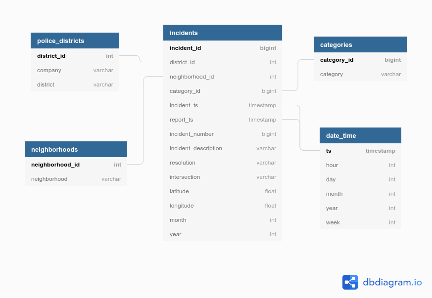
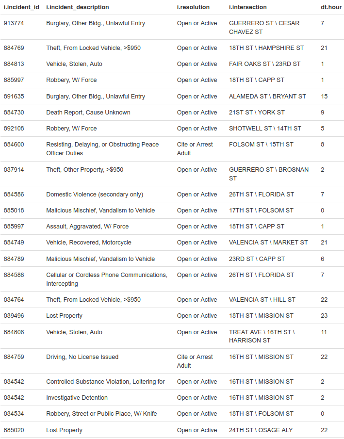
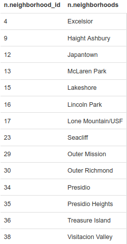

# San Francisco Crime

## An analysis of [SFPD](https://www.sanfranciscopolice.org/) police incidents using [Apache Spark Python](https://spark.apache.org/docs/latest/api/python/) on [Hadoop](https://hadoop.apache.org/)

## Background
[Apache Spark](https://spark.apache.org/docs/latest/index.html) is a data processing framework that can quickly perform processing tasks on very large data sets.  It supports tools such as [Spark SQL](https://spark.apache.org/docs/latest/sql-programming-guide.html) for SQL and structured data processing.  PySpark is the interface that gives access to Spark using the Python programming language.

In this project, we are analyzing police incident report data using PySpark, Spark SQL and the [Dataframe API](https://spark.apache.org/docs/latest/sql-programming-guide.html).

### Local Hadoop instance

There are various options available.  For this analysis, we are using [Hortonworks Data Platform (HDP) Sandbox](https://www.cloudera.com/downloads/hortonworks-sandbox.html) 2.5.0 running on Docker.  Spark jobs are run using Spark 2.0.

Detailed HDP Sandbox installation and setup instructions are available [here](https://www.cloudera.com/tutorials/learning-the-ropes-of-the-hdp-sandbox.html).

 
### Data source

Primary data source is a dataset of [police incident reports](https://data.sfgov.org/Public-Safety/Police-Department-Incident-Reports-2018-to-Present/wg3w-h783) from 2018 to present (4/11/2020).  Additional supplemental reports are also used for supporting dimensional data.

### Data model

<p align="center">
    
</p>

### Relational data store

For our data model above, data will be stored on [HDFS](https://hadoop.apache.org/docs/r1.2.1/hdfs_user_guide.html) in ORC format and [Apache Hive](https://hive.apache.org/) will be used for ad-hoc querying and data analysis.

There are various methods for [creating the tables](create_tables.sql) in Hadoop, including the Hive CLI, by using Spark, and with the query editor in the Hive View in [Apache Ambari](https://ambari.apache.org/), the Hadoop management web UI that is included in HDP.


## ETL

The file [crime-etl.py](crime-etl.py) is our initial Spark job.  

The following command copies the file from our local machine to the HDP Sandbox (maria_dev is the default user on HDP):

```
$ scp -P 2222 crime-etl.py maria_dev@localhost:crime-etl.py
```

To run the Spark application in HDP, we SSH into the docker Sandbox:
```
$ ssh -p 2222 maria_dev@localhost
```
and then run the job using `spark-submit`:
```
$ spark-submit \
  --master local \
  --num-executors 1 \
  --driver-memory 512m \
  --executor-memory 512m \
  --executor-cores 1 \
  crime-etl.py
```
(The above command option values are for launching applications on a local Hadoop installation such as HDP Sandbox.  [Spark documentation](http://spark.apache.org/docs/2.0.0/submitting-applications.html) includes options for supporting different cluster managers and deploy modes.)  

Our application reads source data files on HDFS:
- `Police_Department_Incident_Reports__2018_to_Present.csv`
- `sfpd_districts.csv`
- `San_Francisco_Analysis_Neighborhoods.csv`

transforms the data, and loads dataframes corresponding to each table in our data model.  Each dataframe is saved to its corresponding table in ORC format.


## Ad-hoc queries in Hive

With our tables loaded, we can run queries in Hive to perform analysis on the data.  

Some examples:

<b>Get a list of reported crimes in the Mission on Christmas Day, 2019:</b>
```
SELECT i.incident_id, i.incident_description, i.resolution, i.intersection, dt.hour
FROM incidents i INNER JOIN neighborhoods n ON i.neighborhood_id = n.neighborhood_id
	AND n.neighborhoods = 'Mission'
INNER JOIN date_time dt ON dt.ts = i.incident_ts
WHERE dt.month = 12
	AND dt.day = 25
	AND dt.year = 2019;
```

<p>
    
</P>

<b>Which neighborhoods had no reported burgalaries during the first week of 2020?</b>
```
SELECT n.* FROM neighborhoods n LEFT OUTER JOIN
(
  SELECT i.neighborhood_id, i.incident_id
  FROM incidents i INNER JOIN categories c ON i.category_id = c.category_id 
  	AND c.category = 'Burglary'
  INNER JOIN date_time dt ON dt.ts = i.incident_ts
  WHERE dt.month = 1 AND dt.year = 2020 AND dt.day <= 7
) x
ON x.neighborhood_id = n.neighborhood_id
WHERE x.incident_id IS NULL;
```

<p>
    
</P>


## Data analytics with Spark

As we can see, Hive provides very useful SQL capability on top of Hadoop. For more complex analytics, we can use Spark which processes data in-memory.

We once again load a dataframe of crime incidents.  While we could do this from raw files, since the data is in Hive tables, we can load it from there and display the schema.

```
df = incidents.join(police_districts, police_districts.district_id == incidents.district_id) \
    .join(neighborhoods, neighborhoods.neighborhood_id == incidents.neighborhood_id) \
    .join(categories, categories.category_id == incidents.category_id) \
    .join(date_time, date_time.ts == incidents.incident_ts) \
    .select(
        "district",
        "neighborhood",
        "category",
        col("incident_description").alias("description"),
        "intersection",
        date_time.month,
        "day",
        date_time.year
    )

    df.printSchema()
```

```
root
 |-- district: string (nullable = true)
 |-- neighborhood: string (nullable = true)
 |-- category: string (nullable = true)
 |-- description: string (nullable = true)
 |-- intersection: string (nullable = true)
 |-- month: integer (nullable = true)
 |-- day: integer (nullable = true)
 |-- year: integer (nullable = true)
```

We can now [analyze](analytics.py) the crime data by performing operations on our dataframe using [Spark SQL](https://spark.apache.org/docs/latest/api/python/pyspark.sql.html).

<b>Here's a list of the most common reported crimes based on description.</b>
```
df.groupBy("description").count().sort(col("count").desc()).show()
```
The `show()` method displays the first 20 rows by default.  Additional rows can be displayed by passing in an optional `numRows` parameter.
```
-- most common reported crime based on description --
+-----------------------------------------------+-----+                         
|description                                    |count|
+-----------------------------------------------+-----+
|Theft, From Locked Vehicle, >$950              |40284|
|Battery                                        |9867 |
|Lost Property                                  |9309 |
|Malicious Mischief, Vandalism to Property      |9054 |
|Theft, Other Property, $50-$200                |8547 |
|Mental Health Detention                        |8153 |
|Vehicle, Stolen, Auto                          |6980 |
|Theft, Other Property, >$950                   |6701 |
|Warrant Arrest, Local SF Warrant               |5993 |
|Found  Property                                |5870 |
|Malicious Mischief, Vandalism to Vehicle       |5704 |
|Suspicious Occurrence                          |5499 |
|Investigative Detention                        |5413 |
|Vehicle, Recovered, Auto                       |5367 |
|Theft, From Unlocked Vehicle, >$950            |5216 |
|Theft, From Locked Vehicle, $200-$950          |5165 |
|Warrant Arrest, Enroute To Outside Jurisdiction|4426 |
|Traffic Violation Arrest                       |4292 |
|Found Person                                   |3923 |
|Missing Adult                                  |3512 |
+-----------------------------------------------+-----+
```
As we can see, vehicle break-ins are a huge problem in The City.  
<b>Let's see the neighborhoods that have the most car break-ins.</b>
```
df.filter(col("description").like("%Theft, From Locked Vehicle%")) \
    .groupBy("neighborhood").count().sort(col("count").desc()).show()
```
```
-- reported car break-ins by neighborhood --
+------------------------------+-----+
|neighborhood                  |count|
+------------------------------+-----+
|Mission                       |3991 |
|Financial District/South Beach|3966 |
|North Beach                   |3449 |
|South of Market               |2926 |
|Hayes Valley                  |2776 |
|Russian Hill                  |2762 |
|Western Addition              |2464 |
|Marina                        |2157 |
|Tenderloin                    |2141 |
|Outer Richmond                |1977 |
|Japantown                     |1507 |
|Nob Hill                      |1403 |
|Pacific Heights               |1224 |
|Castro/Upper Market           |1201 |
|Bayview Hunters Point         |1180 |
|Sunset/Parkside               |1074 |
|Golden Gate Park              |1055 |
|Potrero Hill                  |1022 |
|Chinatown                     |881  |
|Inner Richmond                |856  |
+------------------------------+-----+

```
<b>During 2019, show the average number of shopliftings reported each month.</b>
```
df.filter((col("description").like("%Shoplifting%")) & (df["year"] == 2019)) \
    .groupBy("month").count().groupBy("month").agg({'count' : 'avg'}).sort("month").show()
```
```
-- average reported shopliftings per month in 2019
+-----+----------+
|month|avg(count)|
+-----+----------+
|    1|     263.0|
|    2|     250.0|
|    3|     292.0|
|    4|     214.0|
|    5|     219.0|
|    6|     226.0|
|    7|     264.0|
|    8|     248.0|
|    9|     245.0|
|   10|     269.0|
|   11|     243.0|
|   12|     260.0|
+-----+----------+
```
<b>Reported burglaries in each police district during 2019.</b>
```
df.filter((df["category"] == "Burglary") & (df["year"] == 2019)) \
    .groupBy("district").count().show()
```
```
-- reported burglaries in each police district during 2019 --
+----------+-----+
|  district|count|
+----------+-----+
|   Taraval|  920|
| Ingleside| 1194|
|  Southern| 2060|
|  Northern| 1999|
|   Bayview| 1544|
|   Mission| 2109|
|   Central| 2160|
|Tenderloin| 1707|
|      Park|  642|
|  Richmond|  713|
+----------+-----+
```

These are examples of some of the capabitlies of Spark SQL and Dataframes for performing data analytics.  Of course, Spark can scale up to processing terabytes and even petabytes of Big Data in parallel on clusters of multiple computers.  In a future project, we will wrangle data at scale by setting up and running a Spark job on a multi-node cluster.